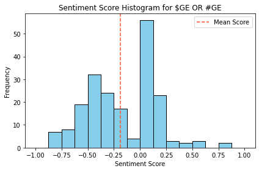

# Project 2
Folder dedicated to all programs related to project 2 for EC601

# Objective
Create a product that allows the user to enter a specific company name or stock symbols, use the Twitter API to gather the 200 most recent tweers regarding the company, then use the Google NLP to analyze the posts to determine the sentiment towards the chosen company/stock.

# Code Output
Running the Project2_final.py file results in a histogram that plots the sentiment scores of the chosen company. This provides a quick and easy way to screen a potential company by seeing how their current investors feel. Generally, if the sentiment scores are positive this means investors are happy about a stock price change or news regarding the company. If the sentiment score is negative this means investors are unhappy due to a negative price change or bad news regarding the company.

# Results

Below are some resulting histogram charts produced by the python program using both the Twitter API and Google NLP.

##Bitcoin (Symbol: BTC)

##Tesla (Symbol: TSLA)

##General Electric (Symbol: GE)

##S&P500 Index (Symbol: SPY)

# Future Improvements
If there is extra time, compare the sentiments on a given stock to the price change following the sentiment calculation.
How accurate was the sentiment? Is there a connection to the price of the stock?
